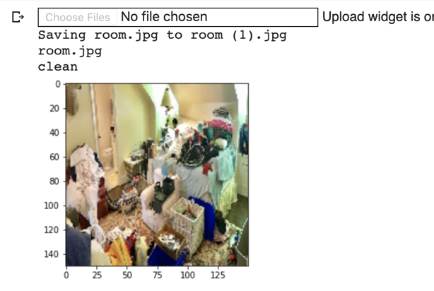

# Belajar Machine Learning untuk Pemula
Result : ⭐⭐⭐⭐
 `Repository ini digunakan untuk dokumentasi hasil Submission dari` [Dicoding](https://www.dicoding.com/academies/184)

## Kriteria Submission Klasifikasi Gambar
* Dataset yang dipakai haruslah dataset berikut : rockpaperscissors, atau gunakan link ini pada wget * command: https://github.com/dicodingacademy/assets/releases/download/release/rockpaperscissors.zip.
* Dataset harus dibagi menjadi train set dan validation set.
* Ukuran validation set harus 40% dari total dataset (data training memiliki 1314 sampel, dan data validasi sebanyak 874 sampel).
* Harus mengimplementasikan augmentasi gambar.
* Menggunakan image data generator.
* Model harus menggunakan model sequential.
* Pelatihan model tidak melebihi waktu 30 menit.
* Program dikerjakan pada Google Colaboratory.
* Akurasi dari model minimal 85%.
* Dapat memprediksi gambar yang diunggah ke Colab seperti gambar di bawah.

* Manambahkan data diri (sesuai profil Dicoding) pada submission/project yang dikirimkan.

Sertifikat : [link](https://www.dicoding.com/certificates/RVZK1EO3MPD5)
